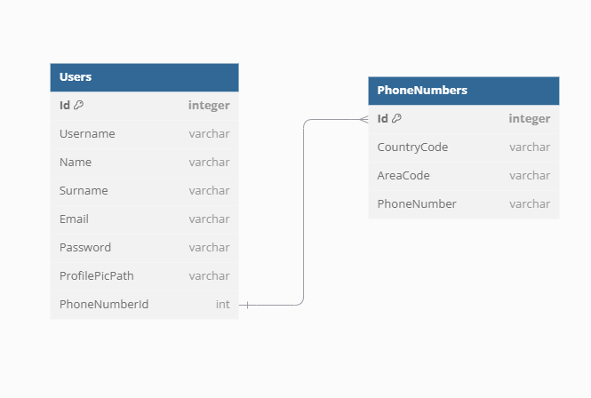

# Reservation-System
## Purpose
The intention behind this project is to put together everything i have learnt and make this application as professional as possible, in order to be hired as a jr Java developer.

# Steps of development
## 1. Analysis and design
   * In this step we will gather as much information as we can in order to understand the domain and the system we are gonna build.  
   We will accomplish this by working closely with the **stakeholders** and then will:
     * Define the requirements
     * Identify the actors
     * Define the use cases or user stories (still in debate)
     * Create a DFD for describing the flow of the program.
     * Use UML for modelling the java classes.
    
## 2. Define the Stack and architecture to be used. 
   * In this case we will use Spring (**not Boot**) and Hexagonal Architecture (Ports and adapters)
   * The Spring modules we will work with are:
       * Spring MVC
       * Spring Data Access (JDBC)
       * Spring Data Access (Transaction Management)

## 3. Implementation
* After the design phase is completed, we will begin coding the system by following the defined requirements and architecture.

## 4. Testing
   * Will make Unit tests at the beginning

## 5. Deployment
   * Yet to define

&nbsp; 

# Development Log
### 20/01/2025
This was the first day of development.
#### **What was done today:** 
   * Created this Readme
   * Created the Github repo
   * Did some investigation about which git workflows to use.

   **Challenges:**
   * None 
---
### 21/01/2025
#### **What was done today:** 
   * Investigate about the domain, looking at examples like booking.com or Airbnb
   * Created the jira project
      * Added the Epics
      * Added the User stories
      * Added some tasks

   * Researched about the best way to store images in a DB, concluded that a **indirect   
   approach** will be used (the path of the image will be stored in the db, not the blob)   
   due to its better performance.

   * Researched about whether to resize the images that will be uploaded or not (**still in discussion**)

   * Read and understood Spring Security Documentation

   * Read about session and cookie storage, and its impact in API Restfullness

   ---
### 22/01/2025
#### **What was done today:** 
   * Started developing the schema for the user entity and realized that storing the phone  
   number isnt as easy as it looks, so i did more research in the topic and found about the [**E.164 Standard**](https://www.twilio.com/docs/glossary/what-e164),   
   which defines a general format for storing international phone numbers. Also found a google library called   
   [**libphonenumber**](https://github.com/google/libphonenumber) that allows  parsing, formatting, and validating international phone numbers.  
   However this wasnt finished yet because in my country (Argentina), besides having to conform with the standard ,   
   its also necessary to append a " 9 " before the phone number if you are calling from another country.  
   So an Argentinian number like this:   
   **11 1234 5678** will be formatted to :  
   **+54 9 11 1234 5678**  
   Even Whatsapp has a link talking about it: https://faq.whatsapp.com/1294841057948784/?cms_id=1294841057948784&draft=false  
   
   * With this in mind the following schema was created:
      * #### **Still need to redefine the primary keys**
   * 
   

   * After having the diagram i finished the use case for the registration functionality.

   * Then realized that the diagram was incomplete so i modified it
   

   * Spent a lot of time reading through java email api and how to use it for sending emails.
   * Decided that will use the [**Gmail Api**](https://developers.google.com/gmail/api/guides/sending), which is free and allows me to send the verification email
   * Continue investigating about Hexagonal architecture and how to organize the package of the application  
   >A lot of the examples i read about hexagonal architecture were using a layered-like approach for organizing the packages,
   where they would have this global packages, like infrastructure,core,etc and put everything in there, i wanted to do something different
   , so i found about package by feature and tried to mix it with the concept of hexagonal.  
   What i will have is: \
   1 - A configuration package containing all the spring configuration.  
   2 - A package for every feature to implement, like login,registration,reservation,etc.
   And inside those packages will be the core, infrastructure and adapters packages.  
   3 - A common or util package for common functionality,
   
Using the prior package structure,i finally started:  
>com.sz.reservation
com.sz.reservation.configuration  -> spring dispatcherServlet and config classes are here.  
com.sz.reservation.registration ->  the registration feature package, contains the core, infrastructure and adapters
com.sz.reservation.registration.core -> contains the PhoneNumber and User classes.
    
   - That is everything i got by now, didnt have time for making the uml so i will paste an screenshot of the package structure and classes here.
      
      
      
      
      

---


### 27/01/2025
In the last days i have been researching and trying to implement the registration feature,  
and found a lot of things to implement. here is a summary of what i did,
* Created the ProfilePicture class
* Learnt about multipart in http
* Configured a multiPartResolver in order to be able to handle this type of file
* Implemented a basic controller for receiving a multipart file
* Realized that i have to verify the real data type of the multipart, because cannot trust
  the client
* Upon researching, found about [Apache Kita](https://tika.apache.org/), which is a content analysis toolkit, and could help me  
  implement what i needed.
* Read the documentation with some examples online, and implemented a FileValidator, which is in a util package  
  at the root level, given that it will be used for different features of the app.
* I didnt like the domain model and how the request data would be binded, so i created a dto called UserRequest,  
  which has all the parameters necessary for creating an user.
* Added validation annotations to the UserRequest.
* I continued reading and trying to adhere to hex architecture as much as possible , so , after modifying the package structure 3 times, it looks like this now: It still can and will be improved as time goes by

* Added a custom exception for handling multipart types that are not allowed,  with a global exception handler
* Implemented the registration use case which has dependencies on the outbound adapters
* Implemented the outbound adapters


#### **What was done today:** 
Today i spent all day learning about testing, more precisely, Unit testing, although i still read about integration testing.
but my focus was on, learn how to use JUnit5 with Spring mvc.
* I read the documentation
* Researched on the internet
* Learned about mocks and [Mockito](https://site.mockito.org/)
* Installed the necessary dependencies using maven
* Did some basic tests and then tried to test my FileValidator class
* At first i wanted to mock my file in order to pass the inputStream to the validator, however,  
  that would be too complex and cannot guarantee that the content inside it is correct.
* So what i did was, use the @BeforeEach and @AfterEach annotations , and a global attribute of type File.
  This assures that before each test is ran, a new file will be created, and after, will be deleted.
* The tests worked perfectly, and did the first commit (i had forgotten to do so) hehe.
* Here is the test:
```java
@ExtendWith(MockitoExtension.class)
class TikaFileValidatorTest {
    private File outputFile;

    @BeforeEach
    public void createPngFile(){
        BufferedImage image = new BufferedImage(50, 50, BufferedImage.TYPE_INT_ARGB);
        image.setRGB(0, 0, 0);
        outputFile = new File("saved.png");
        try {
            Assertions.assertTrue(ImageIO.write(image, "png", outputFile));
        } catch (IOException e) {
            throw new RuntimeException(e);
        }
    }

    @AfterEach
    public void removePngFile(){
        Assertions.assertTrue(outputFile.delete());
    }

    @Test
    public void Should_ReturnRealMediaType_When_ValidInputStream() throws IOException {
        Path tempPath = Path.of(outputFile.getAbsolutePath());
        FileValidator fileValidator = new TikaFileValidator();
        MediaType type = fileValidator.getRealFileType(Files.newInputStream(tempPath, StandardOpenOption.READ));
        Assertions.assertEquals(MediaType.IMAGE_PNG, type);
    }

    @Test
    public void Should_ReturnRealMediaType_When_ExtensionOfFileIsChanged() throws IOException {

        File newFile = new File("saved2.jpeg");
        Assertions.assertTrue(outputFile.renameTo(newFile));
        Path tempPath = Path.of(newFile.getAbsolutePath());
        FileValidator fileValidator = new TikaFileValidator();
        MediaType type  = fileValidator.getRealFileType(Files.newInputStream(tempPath, StandardOpenOption.READ));
        Assertions.assertEquals(MediaType.IMAGE_PNG, type);
        outputFile = newFile;

    }
}
```
---
### 29/01/2025
#### **What was done today:** 
* Wrote more tests for the tika file validator
* Used spring test dependency for mocking a multipart file
* Refactored the Registration Use case by transfering the input Stream handling to the file validator class
* Refactored the tika validator test to make them clearer.
* Added a @DisplayName annotation into the test class
* Added @TestMethodOrder(MethodOrderer.OrderAnnotation.class), which gave me the capability of selecting the execution order.
* Finished the profile picture validation, the only thing left is check the dimension of the photo and compress it or resize it as necessary
* Created a new Exception (EmptyMediaException)
* Created the test class for the registration use case
* Added the (guava)[]library for obtaining the extensions of Files


---
### 31/01/2025
#### **What was done today:** 
* Deleted the EmptyMediaException class, only one exception towars media will be created, MediaNotSupportedException
* Refactored the infrastructure package, by creating a new subpackage ,adapters,where i have the inbound and outbound.
* Added a dto package inside the infrastructure one
* Added a service package inside the infrastructure package
* Created a service package inside the domain, which will hold the domain services
* Created the userCreationService inside the domain services package, responsible for guaranteeing the creation of the user entity in a valid state
* Created a hashing service interface in the domain service package, which will be used for hashing the passwords.
* Created the hashing implementation inside the infrastructure services using bcrypt library from spring Security
* Moved the profile picture validator from the application package to the domain services package, given that i think its part of domain or bussiness validation rather than application, it still can be argued and will as the project grows.
* Modified the phone number and user request class by instead of using 3 attributes for storing the phone number, using 2, country code, and PhoneNumber(which will include area code)
* Added an Email attribute in UserRequest and in user because i had forgotten.
* Changed the name of RegistrationController to HttpRegistrationController
* Tried to implement the libphonenumber library from google but now i have some doubts about my validation in the domain, because i am having a debate wheter to put the validations, if inside the PhoneNumber VO(value object) by injecting a validator into it or by having a validator which will be used by  my userCreationService class,
  the cons with this approach is that allows the creation of a PhoneNumber in invalid state. 
  And if i inject a dependency into a VO ,supposedly is a bad practice, i could define an interface in the same domain package and implement it in the infrastructure package that way the inversion of control is still there, i will check that tomorrow.
* Modified the UserRegistrationDb interface so instead of returning an user it returns an Optional< User>

---
### 01/02/2025
#### **What was done today:** 
* Added the libphonenumber dependency in the pom.xml
* Created the PhoneNumberValidator interface in domain.service package
* Implemented PhoneNumberValidator using libphonenumber in infrastructure.service package
* Created and implemented test class and methods for libphonenumber
* Moved the port package from application to domain
* Moved Exception package from registration.exception to domain.exception
* Moved the globalExceptionHandler from .exception to root package (reservation)
* Changed the name of userCreationService to UserService
* Modified the UserService so it only depends on interfaces from the same domain, allowing to use dependency inversion principle
* Modified the createUser method by renaming it to create.
* Modified the PhoneNumber class so it implements my bussiness invariant, which is that if a number is argentinian , it must have a "9" after the country code and before the area code
* Spent the rest of the day researching in how to handle some invariants of the code, for example i dont like the solution of handling the uniqueness of my users in the domain service,
  and i think its a concern that maybe should not be there, i have some different approaches, like instead of having that domain service for creating the entities and allowing the domain to
  be created in invalid states, i could enforce to pass a validator instance when creating the user class, that validator would contain an instance to the repository, however this would create an additional coupling
  i dont think should be necessary, and it would be harder to test. Other approach would be or handling all directly in the application service, which i dont want to do because i feel that the app service is doing too much
  and it makes an anemic like domain, or, make the necessary call in the app service and pass the data necesary to the domain service.
  Even though this approaches could work, we are not taking in account the concurrency issues that could happen , assume that two users when retrieving data from the repository get that their email or username has NOT been used,
  that means that the creation of the User object is totally possible because they unique, but user 1 finishes firts, then user2 doesnt know that user1 finished, so know user1 has an entity in an invalid state.
  The solution we can apply are diverse. We could use locking inside a transaction for maximun security, but that would be overkill and could cost a lot of perfomance.
  So what i will do is let the repository handle it, by making the fields in the DB, UNIQUE, so when 2 identical emails or usernames try to insert, the db will throw an exception, which will handled by my application.
  I arrived at this thinking after a long day reading through stackOverflow and different sites, (i have 10 google chrome windows open), and deciding that is not a bussiness rule that the username or email must be unique, or, even if it was,
  the overhead of handling it, isnt worth it, at least to me, and, by now.  
  **Evidence of my chrome windows:**
  

---

### 02/02/2025
#### **What was done today:** 
* Created the resizing image service.
* Added a private getExtension method to the fileValidator.
* Eliminated the domain service for user creation to the application services directly.
* Created the output profilePictureStorage port.
* Implemented the ProfilePictureStorage port in the infrastructure service by  storing files in a folder outside the project directory.
* Created the test class for ProfilePictureStorage.
* Added a Test to ProfilePictureStorage.
* Changed the ProfilePicture profileImage to a Image type.
* Added the necessary dependencies in the registrationUseCase controller.
* Created the necessary beans in the root application config.
* Modified the PhoneNumberValidator to accept the countrycode and phone number as different variables and not encapsulated in the PhoneNumber object
* Deleted the ID attribute from user
* Deleted the id attribute from PhoneNumber
* Modified the profile picture validator so it also validates the extension of the file to the real content of the file.

